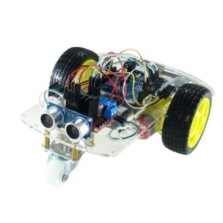

ROBI
====

Arduino konstruktor ROBI

Project details: http://www.oomipood.ee/product/robi/

[EST] Omanda teadmisi robootikast pannes ise komponentidest kokku toimiv robot. Robi on võimeline keerama paremale ja vasakule ning sõitma edasi ja tagasi. Robi sõidab automaatrežiimil ringi ja väldib takistusi tänu ultraheli moodulile.
Võimalik on ka Robi käsitsijuhtimine läbi Android seadme - täpselt nagu puldiauto.
